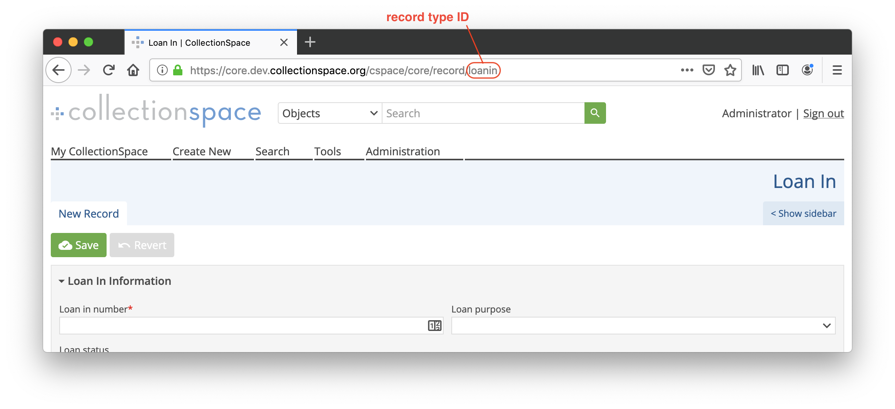
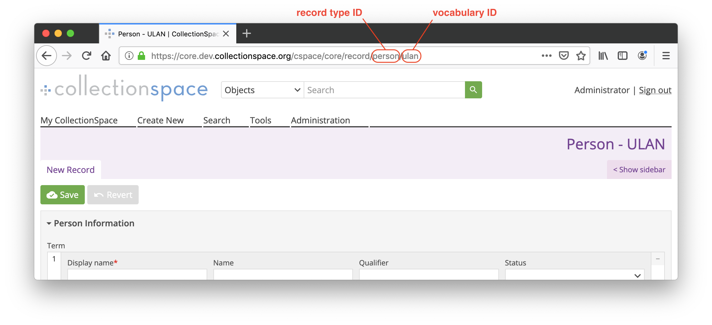

# Hiding record types and vocabularies

Record types may be disabled, preventing them from appearing in the UI, including on the Create New and Search screens. Individual vocabularies within authority record types may also be disabled.

## Finding the record type and vocabulary ID

To find the ID of the record type you want to hide, create a new record of the type from the Create New screen. The ID of the record type will be in the URL of the new record, after `record/`. For example, for a Loan In record, the ID is `loanin`.



If you're hiding a vocabulary within an authority record type, you'll also need the ID of the vocabulary. This is the part of the URL after the record type ID. For example, for the ULAN vocabulary in the Person record type, the vocabulary ID is `ulan` (and the record type ID is `person`).



## Disabling a record type

To disable a record type, set the nested property `recordTypes.{recordTypeID}.disabled` to `true` in your configuration.

```
<html>
  <head>
    <meta charset="UTF-8">
  </head>
  <body>
    <div id="cspace"></div>
    <script src="http://unpkg.com/cspace-ui@1.0.0/dist/cspaceUI.min.js"></script>
    <script>
      cspaceUI({
        recordTypes: {
          loanin: {
            disabled: true,
          },
        },
      });
    </script>
  </body>
</html>
```

## Disabling a vocabulary

To disable a vocabulary within an authority record type, set the nested property `recordTypes.{recordTypeID}.vocabularies.{vocabularyID}.disabled` to `true` in your configuration.

⚠️To disable all vocabularies in an authority, disable the entire authority record type following the above instructions, instead of disabling each vocabulary individually.

```
<html>
  <head>
    <meta charset="UTF-8">
  </head>
  <body>
    <div id="cspace"></div>
    <script src="http://unpkg.com/cspace-ui@1.0.0/dist/cspaceUI.min.js"></script>
    <script>
      cspaceUI({
        recordTypes: {
          person: {
            vocabularies: {
              ulan: {
                disabled: true,
              },
            },
          },
        },
      });
    </script>
  </body>
</html>
```
