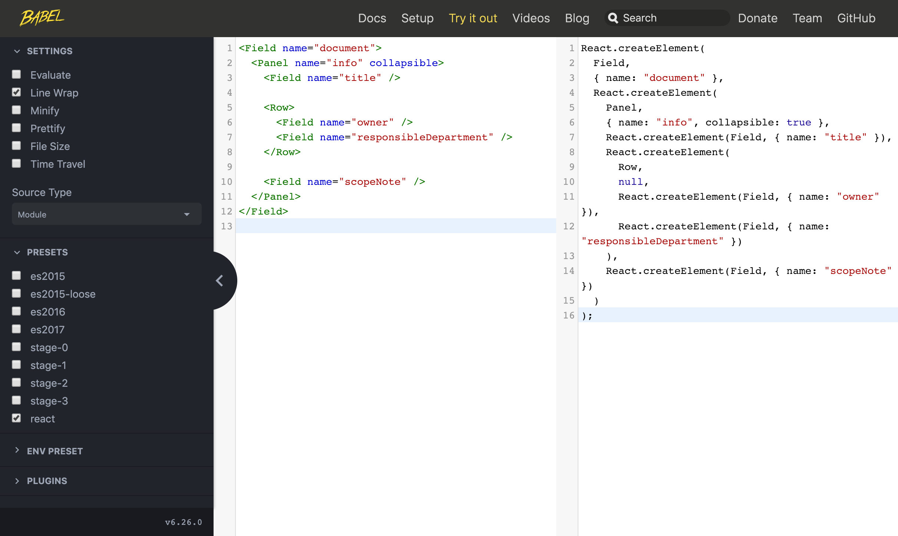

# Reordering Fields

To reorder the fields on the form for editing a record, provide a form template that overrides the current form template for the record type.

## Preparing the configuration

First, modify the HTML file for the tenant to use the more advanced configuration method: instead of supplying a configuration object to the `cspaceUI` function, supply a configurer function that returns a configuration object:

```
<html>
  <head>
    <meta charset="UTF-8">
  </head>
  <body>
    <div id="cspace"></div>
    <script src="http://unpkg.com/cspace-ui@1.0.0/dist/cspaceUI.min.js"></script>
    <script>
      cspaceUI((configContext) => {
        return {
          // Configuration properties
        };
      });
    </script>
  </body>
</html>
```

For this first step, return the existing configuration object from a function, but keep all of the configuration properties the same.

The `configContext` object passed to the configurer function contains some properties that will be needed when reordering fields. Declare these above the `return {` line:

```
<html>
  <head>
    <meta charset="UTF-8">
  </head>
  <body>
    <div id="cspace"></div>
    <script src="http://unpkg.com/cspace-ui@1.0.0/dist/cspaceUI.min.js"></script>
    <script>
      cspaceUI((configContext) => {
        const {
          React,
        } = configContext.lib;

        const {
          Col,
          Cols,
          Panel,
          Row,
        } = configContext.layoutComponents;

        const {
          Field,
          InputTable,
        } = configContext.recordComponents;

        return {
          // Configuration properties
        };
      });
    </script>
  </body>
</html>
```

## Finding the current form

In the source code of the CollectionSpace UI, the `src/plugins/recordTypes` directory [(GitHub)](https://github.com/collectionspace/cspace-ui.js/tree/master/src/plugins/recordTypes) contains a subdirectory for each record type. Each subdirectory contains a subdirectory named `forms`, which contains the form templates for that record type. For example, the forms for the Group record are located in `src/plugins/recordTypes/group/forms` [(GitHub)](https://github.com/collectionspace/cspace-ui.js/tree/master/src/plugins/recordTypes/group/forms). In the `forms` directory, every record type contains a default form (`default.jsx`). Some record types contain alternate forms that are selectable by users; for example, the Intake record contains a Doorstep Donation form (`doorstep.jsx`). Find the form that you wish to customize.

## Modifying the form template

The template for a form is defined in the `template` function of the form. For example, the Group record's default form template is located in `src/plugins/recordTypes/group/forms/default.jsx` [(GitHub)](https://github.com/collectionspace/cspace-ui.js/blob/master/src/plugins/recordTypes/group/forms/default.jsx):

```
<Field name="document">
  <Panel name="info" collapsible>
    <Field name="title" />

    <Row>
      <Field name="responsibleDepartment" />
      <Field name="owner" />
    </Row>

    <Field name="scopeNote" />
  </Panel>
</Field>
```

Fields can be reordered by copying this template, and changing the position of the `<Field>` tags. For example, in the Group record, the positions of the responsible department field and the owner field can be swapped by changing the order of the fields in the template:

```
<Field name="document">
  <Panel name="info" collapsible>
    <Field name="title" />

    <Row>
      <Field name="owner" />
      <Field name="responsibleDepartment" />
    </Row>

    <Field name="scopeNote" />
  </Panel>
</Field>
```

## Compiling the template

The form templates in CollectionSpace source code are written with JSX — XML tags embedded in JavaScript code. The JSX must be compiled to JavaScript before adding it to the configuration in the HTML file. Babel may be used to do this. In a browser, [open Babel](https://babeljs.io/en/repl#?babili=false&browsers=&build=&builtIns=false&spec=false&loose=false&code_lz=Q&debug=false&forceAllTransforms=false&shippedProposals=false&circleciRepo=&evaluate=false&fileSize=false&timeTravel=false&sourceType=module&lineWrap=true&presets=react), and copy your modified template  into the left side (at the "Write code here" prompt). The JavaScript output will appear on the right:



## Setting the template

To override the current template with your modified template, set the nested configuration property `recordTypes.{record type}.forms.{form name}.template`, substituting the record type and form name. For example:

```
<html>
  <head>
    <meta charset="UTF-8">
  </head>
  <body>
    <div id="cspace"></div>
    <script src="http://unpkg.com/cspace-ui@1.0.0/dist/cspaceUI.min.js"></script>
    <script>
      cspaceUI((configContext) => {
        const {
          React,
        } = configContext.lib;

        const {
          Col,
          Cols,
          Panel,
          Row,
        } = configContext.layoutComponents;

        const {
          Field,
          InputTable,
        } = configContext.recordComponents;

        return {
          // Configuration properties
          recordTypes: {
            group: {
              forms: {
                default: {
                  template: // Modified template
                },
              },
            },
          },
        };
      });
    </script>
  </body>
</html>
```

Copy the JavaScript output from Babel, and paste it into the configuration, after `template:`. Replace the last semicolon in the pasted JS code with a comma. For example:

```
<html>
  <head>
    <meta charset="UTF-8">
  </head>
  <body>
    <div id="cspace"></div>
    <script src="http://unpkg.com/cspace-ui@1.0.0/dist/cspaceUI.min.js"></script>
    <script>
      cspaceUI((configContext) => {
        const {
          React,
        } = configContext.lib;

        const {
          Col,
          Cols,
          Panel,
          Row,
        } = configContext.layoutComponents;

        const {
          Field,
          InputTable,
        } = configContext.recordComponents;

        return {
          // Configuration properties
          recordTypes: {
            group: {
              forms: {
                default: {
                  template: React.createElement(
                    Field,
                    { name: "document" },
                    React.createElement(
                      Panel,
                      { name: "info", collapsible: true },
                      React.createElement(Field, { name: "title" }),
                      React.createElement(
                        Row,
                        null,
                        React.createElement(Field, { name: "owner" }),
                        React.createElement(Field, { name: "responsibleDepartment" })
                      ),
                      React.createElement(Field, { name: "scopeNote" })
                    )
                  ),
                },
              },
            },
          },
        }
      });
    </script>
  </body>
</html>
```

The record should now appear with the reordered fields.
