# CollectionSpace UI Style Guide

This document contains guidelines to follow in order to maintain a consistent look and feel throughout the CollectionSpace user interface.

- [Panels](#panels)
- [Fields](#fields)
  - [Repeating Fields](#repeating-fields)
  - [Repeating Field Groups](#repeating-field-groups)
  - [Input Tables](#input-tables)
- [Option Lists](#option-lists)


## Panels

1. Panel labels should be title case.

1. The first information group panel on a record editor form should default to expanded. All others should default to collapsed.

   Why: Records render faster and use less memory when panels are collapsed. The collapsed state of each panel is remembered for each user, so if a user wants a panel to be open, they can open it, and it will remain open on the next visit.

## Fields

1. Field labels should be sentence case.

1. Tab order: Down a column to the end, then to the top of the next column.

   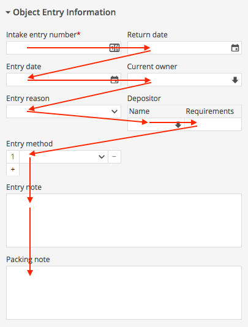

   ```JSX
   // 🚫 BAD

   <Panel name="objectEntryInfo" collapsible>
     <Row>
       <Field name="entryNumber" />
       <Field name="returnDate" />
     </Row>

     <Row>
       <Field name="entryDate" />
       <Field name="currentOwner" />
     </Row>

     <Row>
       <Field name="entryReason" />

       <InputTable name="depositor">
         <Field name="depositor" />
         <Field name="depositorsRequirements" />
       </InputTable>
     </Row>

     <Cols>
       <Col>
         <Field name="entryMethods">
           <Field name="entryMethod" />
         </Field>
       </Col>
       <Col />
     </Cols>
   </Panel>
   ```

   

   ```JSX
   // ✅ GOOD

   <Panel name="objectEntryInfo" collapsible>
     <Cols>
       <Col>
         <Field name="entryNumber" />
         <Field name="entryDate" />
         <Field name="entryReason" />

         <Field name="entryMethods">
           <Field name="entryMethod" />
         </Field>
       </Col>

       <Col>
         <Field name="returnDate" />
         <Field name="currentOwner" />

         <InputTable name="depositor">
           <Field name="depositor" />
           <Field name="depositorsRequirements" />
         </InputTable>
       </Col>
     </Cols>

     <Field name="entryNote" />
     <Field name="packingNote" />
   </Panel>
   ```

### Repeating Fields

In CollectionSpace, repeating (multi-valued) fields are always modeled as a pair of nested fields: an outer (parent) field, and an inner (child) field. For example, in the record type configuration for `intake` records, the multi-valued *entry method* field is defined as:

```JavaScript
{
  entryMethods: {
    [config]: {
      // ...
    },
    entryMethod: {
      [config]: {
        repeating: true,
        // ...
      },
    },
  },
};
```

Only the inner field (in this case, `entryMethod`) has its `repeating` property set to `true`. Conceptually, this says that *entry methods* consists of one or more *entry method*. Because of this field structure, there are two possible places to define messages for a repeating field.

1. Do not define the `name` message on both the outer and inner fields.

   Why: Defining `name` messages on both the outer and inner fields causes two labels to be rendered on the record editor form, and is almost always redundant.

   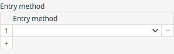

   ```JavaScript
   // 🚫 BAD - name defined on both outer and inner fields

   {
     entryMethods: {
       [config]: {
         messages: defineMessages({
           name: {
             id: 'field.intakes_common.entryMethods.name',
             defaultMessage: 'Entry method',
           },
         }),
         // ...
       },
       entryMethod: {
         [config]: {
            messages: defineMessages({
             name: {
               id: 'field.intakes_common.entryMethod.name',
               defaultMessage: 'Entry method',
             },
           }),
           repeating: true,
          // ...
         },
       },
     },
   };

   ```

   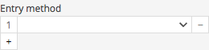

   ```JavaScript
   // ✅ GOOD - name defined only on inner field

   {
     entryMethods: {
       [config]: {
         // ...
       },
       entryMethod: {
         [config]: {
           messages: defineMessages({
             name: {
               id: 'field.intakes_common.entryMethod.name',
               defaultMessage: 'Entry method',
             },
           }),
           repeating: true,
           // ...
         },
       },
     },
   };
   ```
   
1. Define the `name` message on the inner field.

   Why: In addition to the record editor form, the `name` message of the inner field is used in other places, such as the record sidebar and search form. Not defining it may result in the raw field name being displayed to the user in these places.

   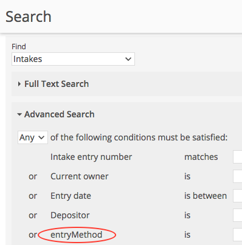

   ```JavaScript
   // 🚫 BAD - name defined on outer field instead
   // of inner field

   {
     entryMethods: {
       [config]: {
         messages: defineMessages({
           name: {
             id: 'field.intakes_common.entryMethods.name',
             defaultMessage: 'Entry method',
           },
         }),
         // ...
       },
       entryMethod: {
         [config]: {
           repeating: true,
           // ...
         },
       },
     },
   };
   ```

   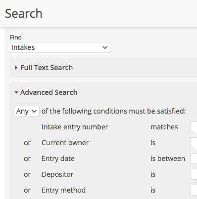

   ```JavaScript
   // ✅ GOOD - name defined on inner field

   {
     entryMethods: {
       [config]: {
         // ...
       },
       entryMethod: {
         [config]: {
           repeating: true,
           messages: defineMessages({
             name: {
               id: 'field.intakes_common.entryMethod.name',
               defaultMessage: 'Entry method',
             },
           }),
           // ...
         },
       },
     },
   };
   ```

### Repeating Field Groups

A repeating group of fields is modeled like any repeating field, with an outer parent field containing a single inner repeating child. The only difference is that the inner field happens to be a *group*, meaning that it has child fields of its own (the *group members*). The above rules about defining messages continue to apply to the outer field and the inner (group) field.

A group field is typically configured with the view type `CompoundInput`. The `CompoundInput` component can render the member fields in a table, or it can render the member fields using a template you supply.

1. Use a table (set the `tabular` prop to `true` in the field's view configuration) when the group contains a small number of fields whose values are expected to be short.

1. Define a `name` message for the group field.

   Why: This causes a label to be rendered for the entire group, making it easy for users to see how the how the member fields are related.

1. Avoid repeating the label (`name` message) of the group on the label (`name` message) of any member field in the group. Usually you can either shorten the member field label to save space, or change it to something that gives the user more information.

   Why: Don't waste space on redundant/uninformative labels.

   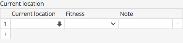

   ```JavaScript
   // 🚫 BAD - 'Current location' is repeated in the
   // group label and a member field label

   currentLocationGroupList: {
     [config]: {
       // ...
     },
     currentLocationGroup: {
       [config]: {
         messages: defineMessages({
           name: {
             id: 'field.intakes_common.currentLocationGroup.name',
             defaultMessage: 'Current location',
           },
         }),
         repeating: true,
         // ...
       },
       currentLocation: {
         [config]: {
           messages: defineMessages({
             name: {
               id: 'field.intakes_common.currentLocation.name',
               defaultMessage: 'Current location',
             },
           }),
           // ...
         },
       },
       // ...
     },
   },
   ```
   
   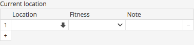

   ```JavaScript
   // ✅ GOOD - Shorten the member field label

   currentLocationGroupList: {
     [config]: {
       // ...
     },
     currentLocationGroup: {
       [config]: {
         messages: defineMessages({
           name: {
             id: 'field.intakes_common.currentLocationGroup.name',
             defaultMessage: 'Current location',
           },
         }),
         repeating: true,
         // ...
       },
       currentLocation: {
         [config]: {
           messages: defineMessages({
             name: {
               id: 'field.intakes_common.currentLocation.name',
               defaultMessage: 'Location',
             },
           }),
           fullName: {
             id: 'field.intakes_common.currentLocation.fullName',
             defaultMessage: 'Current location',
           },
         },
       },
       // ...
     },
   },
   ```
   
   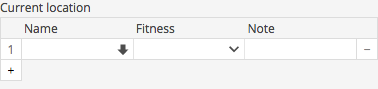

   ```JavaScript
   // ✅ GOOD - Change the member field label to
   // something that further describes the content
   // of the field

   currentLocationGroupList: {
     [config]: {
       // ...
     },
     currentLocationGroup: {
       [config]: {
         messages: defineMessages({
           name: {
             id: 'field.intakes_common.currentLocationGroup.name',
             defaultMessage: 'Current location',
           },
         }),
         repeating: true,
         // ...
       },
       currentLocation: {
         [config]: {
           messages: defineMessages({
             name: {
               id: 'field.intakes_common.currentLocation.name',
               defaultMessage: 'Name',
             },
           }),
           fullName: {
             id: 'field.intakes_common.currentLocation.fullName',
             defaultMessage: 'Current location name',
           },
         },
       },
       // ...
     },
   },
   ```
   
1. Avoid repetitive member field labels. If some text appears in the label of every member field, it probably belongs in the label of the group.

   Why: Don't waste space on redundant/uninformative labels.
   
   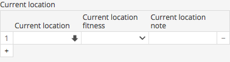

   ```JavaScript
   // 🚫 BAD - 'Current location' is repeated on all
   // member labels

   currentLocationGroupList: {
     [config]: {
       // ...
     },
     currentLocationGroup: {
       [config]: {
         messages: defineMessages({
           name: {
             id: 'field.intakes_common.currentLocationGroup.name',
             defaultMessage: 'Current location',
           },
         }),
         repeating: true,
         view: {
           type: CompoundInput,
           props: {
             tabular: true,
           },
         },
       },
       currentLocation: {
         [config]: {
           messages: defineMessages({
             name: {
               id: 'field.intakes_common.currentLocation.name',
               defaultMessage: 'Current location',
             },
           }),
           // ...
         },
       },
       currentLocationFitness: {
         [config]: {
           messages: defineMessages({
             name: {
               id: 'field.intakes_common.currentLocationFitness.name',
               defaultMessage: 'Current location fitness',
             },
           }),
           // ...
         },
       },
       currentLocationNote: {
         [config]: {
           messages: defineMessages({
             name: {
               id: 'field.intakes_common.currentLocationNote.name',
               defaultMessage: 'Current location note',
             },
           }),
           // ...
         },
       },
     },
   },
   ```
   
   

   ```JavaScript
   // ✅ GOOD - Remove redundant text that's already
   // in the group label

   currentLocationGroupList: {
     [config]: {
       // ...
     },
     currentLocationGroup: {
       [config]: {
         messages: defineMessages({
           name: {
             id: 'field.intakes_common.currentLocationGroup.name',
             defaultMessage: 'Current location',
           },
         }),
         repeating: true,
         view: {
           type: CompoundInput,
           props: {
             tabular: true,
           },
         },
       },
       currentLocation: {
         [config]: {
           messages: defineMessages({
             name: {
               id: 'field.intakes_common.currentLocation.name',
               defaultMessage: 'Location',
             },
             fullName: {
               id: 'field.intakes_common.currentLocation.fullName',
               defaultMessage: 'Current location',
             },
           }),
           // ...
         },
       },
       currentLocationFitness: {
         [config]: {
           messages: defineMessages({
             name: {
               id: 'field.intakes_common.currentLocationFitness.name',
               defaultMessage: 'Fitness',
             },
             fullName: {
               id: 'field.intakes_common.currentLocationFitness.fullName',
               defaultMessage: 'Current location fitness',
             },
           }),
           // ...
         },
       },
       currentLocationNote: {
         [config]: {
           messages: defineMessages({
             name: {
               id: 'field.intakes_common.currentLocationNote.name',
               defaultMessage: 'Note',
             },
             fullName: {
               id: 'field.intakes_common.currentLocationNote.fullName',
               defaultMessage: 'Current location note',
             },
           }),
           // ...
         },
       },
     },
   },
   ```

1. Define a `fullName` message for each member field, unless the `name` message is sufficient to identify the field when it is used out of context.

### Input Tables

1. Use an input table (`InputTable` element in form template configuration) to visually join together a small number of related fields whose values are expected to be short.

1. Always supply a `name` to the input table, and define a message for it.

   Why: This causes a label to be rendered for the entire table, making it easy for users to see how the fields are related.

   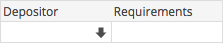

   ```JSX
   // 🚫 BAD - no name specified on InputTable

   <InputTable>
     <Field name="depositor" />
     <Field name="depositorsRequirements" />
   </InputTable>
   ```

   

   ```JSX
   // ✅ GOOD - name specified on InputTable

   <InputTable name="depositor">
     <Field name="depositor" />
     <Field name="depositorsRequirements" />
   </InputTable>

   // ✅ GOOD - message defined for the name

   {
     inputTable: defineMessages({
       depositor: {
         id: 'inputTable.intake.depositor',
         defaultMessage: 'Depositor',
       },
     }),
   };
   ```

1. Avoid repeating the label of the input table on the label (`name` message) of any field in the table. Usually you can either shorten the field label to save space, or change it to something that gives the user more information.

   Why: Don't waste space on redundant/uninformative labels.

1. Avoid repetitive field labels. If a word appears in every field label, it probably belongs in the label of the table.

   Why: Don't waste space on redundant/uninformative labels.

1. Define a `fullName` message for each field in the table, unless the `name` message is sufficient to identify the field when it is used out of context.

   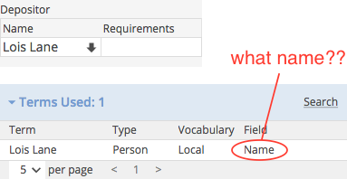

   ```JavaScript
   // 🚫 BAD - fullName not defined on a field in
   // an input table, where the name is ambiguous

   {
     depositor: {
       [config]: {
         messages: defineMessages({
           name: {
             id: 'field.intakes_common.depositor.name',
             defaultMessage: 'Name',
           },
         }),
         // ...
     },
   };
   ```

   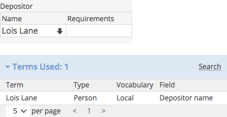

   ```JavaScript
   // ✅ GOOD - fullName defined to fully
   // describe the field

   {
     depositor: {
       [config]: {
         messages: defineMessages({
           name: {
             id: 'field.intakes_common.depositor.name',
             defaultMessage: 'Name',
           },
           fullName: {
             id: 'field.intakes_common.depositor.fullName',
             defaultMessage: 'Depositor name',
           },
         }),
         // ...
     },
   };
   ```
   
## Option Lists

- Option labels should be lowercase, except for proper nouns and abbreviations that are normally capitalized.
